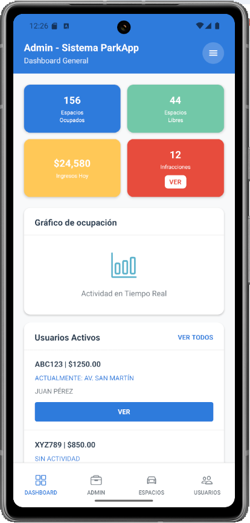
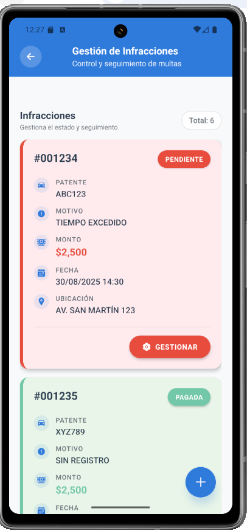

# ParkApp - Sistema de Gestión de Estacionamiento

ParkApp es una aplicación móvil integral construida con React Native y TypeScript que facilita la gestión de espacios de estacionamiento. La aplicación atiende dos roles principales de usuario: usuarios finales que buscan soluciones de estacionamiento y administradores que supervisan las operaciones del sistema de estacionamiento.

## 🚀 Características

### 👤 Características para Usuarios Finales
- **Registro y Autenticación de Usuarios**: Registro seguro y login con validación completa de formularios
- **Gestión de Estacionamiento**: Sesiones de estacionamiento activas, registro de vehículos e historial de estacionamiento
- **Mapa Interactivo**: Visualización en tiempo real de espacios de estacionamiento usando mapas
- **Gestión de Saldo**: Funcionalidad de billetera para pagos de estacionamiento y recargas
- **Notificaciones**: Alertas en tiempo real para estado de estacionamiento, multas y actualizaciones de saldo
- **Gestión de Perfil**: Configuración de cuenta de usuario y gestión de sesiones

### 🛠️ Características para Administradores
- **Análisis del Dashboard**: Estadísticas en tiempo real e indicadores clave de rendimiento
- **Gestión de Usuarios**: Administración y monitoreo completo de usuarios
- **Gestión de Espacios**: Configuración y supervisión de espacios de estacionamiento
- **Gestión de Infracciones**: Emisión y seguimiento de violaciones de estacionamiento
- **Registro Manual**: Capacidades de registro administrativo de vehículos
- **Configuración del Sistema**: Configuraciones de la aplicación y parámetros

## 🛠️ Stack Tecnológico

### Tecnologías Core
- **React Native 0.81.4**: Desarrollo móvil multiplataforma
- **Expo ~54.0.9**: Plataforma de desarrollo y herramientas de construcción
- **TypeScript ~5.9.2**: Desarrollo JavaScript con tipos seguros

### Navegación y UI
- **React Navigation**: Navegación Stack, Tab y Drawer
- **Styled Components 6.1.19**: Solución de estilos CSS-in-JS
- **Expo Vector Icons**: Librería de iconos
- **React Native Animatable**: Librería de animaciones

### Mapas y Ubicación
- **React Native Maps 1.20.1**: Componentes de mapas interactivos
- **Expo Location ~19.0.7**: Servicios de ubicación y permisos

### Datos y Almacenamiento
- **Async Storage**: Persistencia de datos locales
- **Expo Secure Store**: Almacenamiento seguro de clave-valor
- **React Native Get Random Values**: Utilidades criptográficas

### Herramientas de Desarrollo
- **Expo Camera ~17.0.8**: Funcionalidad de cámara para escaneo
- **Expo Linear Gradient**: Fondos con gradientes
- **React Native Reanimated ~4.1.0**: Animaciones avanzadas
- **React Native Gesture Handler**: Gestión de gestos táctiles

## 📁 Estructura del Proyecto

```
parkapp/
├── assets/                          # Activos estáticos (iconos, imágenes)
├── components/                      # Componentes UI reutilizables
│   ├── adminpanel/                  # Componentes específicos de admin
│   ├── auth/                        # Componentes de autenticación
│   ├── cards/                       # Componentes de tarjetas
│   ├── common/                      # Componentes comunes compartidos
│   ├── dashboard/                   # Widgets del dashboard
│   ├── grids/                       # Diseños de cuadrícula
│   ├── infractions/                 # Gestión de infracciones
│   ├── modals/                      # Diálogos modales
│   ├── navigation/                  # Componentes de navegación
│   ├── registration/                 # Componentes de registro
│   └── shared/                      # Utilidades y contexto compartidos
├── constants/                       # Constantes y configuraciones de la app
├── hooks/                           # Hooks personalizados de React
├── screens/                         # Componentes de pantalla
│   ├── admin/                       # Pantallas de admin
│   ├── auth/                        # Pantallas de autenticación
│   └── user/                        # Pantallas de usuario
├── services/                        # Servicios API y lógica de negocio
└── utils/                           # Funciones utilitarias y helpers
```

## 🚀 Instalación y Configuración

### Prerrequisitos
- Node.js (v16 o superior)
- npm o yarn
- Expo CLI
- Android Studio (para desarrollo Android)
- Xcode (para desarrollo iOS, solo macOS)

### Pasos de Instalación

1. **Clonar el repositorio**
   ```bash
   git clone <https://github.com/Liria95/parkapp.git>
   cd parkapp
   ```

2. **Instalar dependencias**
   ```bash
   npm install
   ```

3. **Iniciar el servidor de desarrollo**
   ```bash
   npm start
   # o
   npx expo start
   ```

4. **Ejecutar en plataforma específica**
   ```bash
   # Android
   npm run android
   # o
   npx expo start --android

   # iOS
   npm run ios
   # o
   npx expo start --ios

   # Web
   npm run web
   # o
   npx expo start --web
   ```

## 📱 Uso
## 📸 Capturas de Pantalla

### 👤 Usuario Final
<p align="center">
 
  
  
  
  
</p>

### 🛠️ Administrador
<p align="center">

  
  
</p>


### Para Usuarios Finales
1. **Registrarse**: Crear una nueva cuenta con validación de email y contraseña
2. **Iniciar Sesión**: Autenticarse con sus credenciales
3. **Buscar Estacionamiento**: Usar el mapa para localizar espacios disponibles
4. **Iniciar Estacionamiento**: Registrar su vehículo y comenzar sesión de estacionamiento
5. **Gestionar Saldo**: Recargar su billetera y monitorear gastos
6. **Ver Historial**: Revisar historial de estacionamiento y multas recibidas

### Para Administradores
1. **Iniciar Sesión**: Usar credenciales de admin para acceder al panel administrativo
2. **Dashboard**: Monitorear estadísticas del sistema y actividad de usuarios
3. **Gestionar Usuarios**: Ver, editar y administrar cuentas de usuario
4. **Manejar Infracciones**: Emitir y rastrear violaciones de estacionamiento
5. **Configurar Espacios**: Configurar y gestionar áreas de estacionamiento
6. **Registro Manual**: Registrar vehículos en nombre de usuarios

## 🔐 Cuentas de Prueba

### Cuentas de Administrador
- **Email**: admin@gmail.com | **Contraseña**: admin123
- **Email**: admin@parkapp.com | **Contraseña**: admin123

### Registro de Usuario
- **Email**: usuario@gmail.com | **Contraseña**: 123456
- Los nuevos usuarios pueden registrarse a través de la pantalla de registro de la aplicación
- Todos los registros requieren verificación de email y confirmación de contraseña

## 📋 Componentes Clave

### Sistema de Autenticación
- Funcionalidad segura de login/logout
- Validación de formularios con retroalimentación en tiempo real
- Detección automática de rol de usuario

### Integración de Mapas
- Visualización interactiva de espacios de estacionamiento
- Actualizaciones de disponibilidad en tiempo real
- Servicios basados en ubicación

### Sistema de Notificaciones
- Alertas de sesiones de estacionamiento
- Notificaciones de multas
- Advertencias de saldo

### Panel de Administración
- Dashboard completo con KPIs
- Interfaz de gestión de usuarios
- Sistema de rastreo de infracciones

## 🤝 Contribuyendo

1. LIRIA OLIVERA
2. ANABELLA VENTAVOLI
3. MONICA MARIA ZULUAGA PELAEZ
4. MARIANELA DAGATTI
5. PABLO CONTRERAS


## 📄 Licencia

Este proyecto está licenciado bajo la Licencia MIT - ver el archivo [LICENSE](LICENSE) para más detalles.

## 📞 Soporte

Para soporte y preguntas, por favor contacte al equipo de desarrollo o cree un issue en el repositorio.

---

**Construido con usando React Native & Expo**

