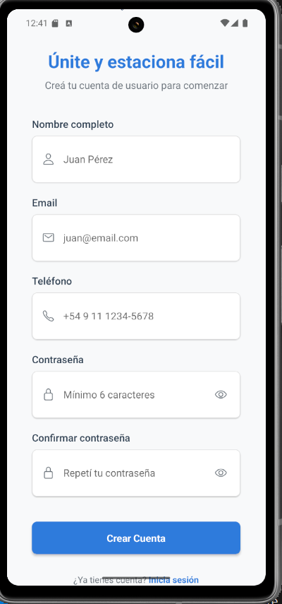
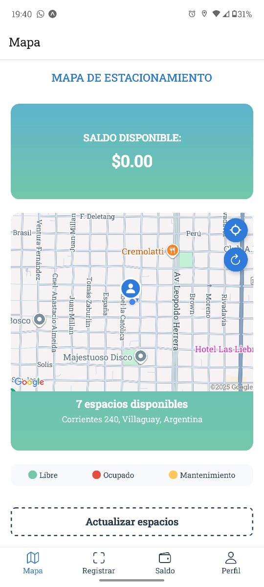
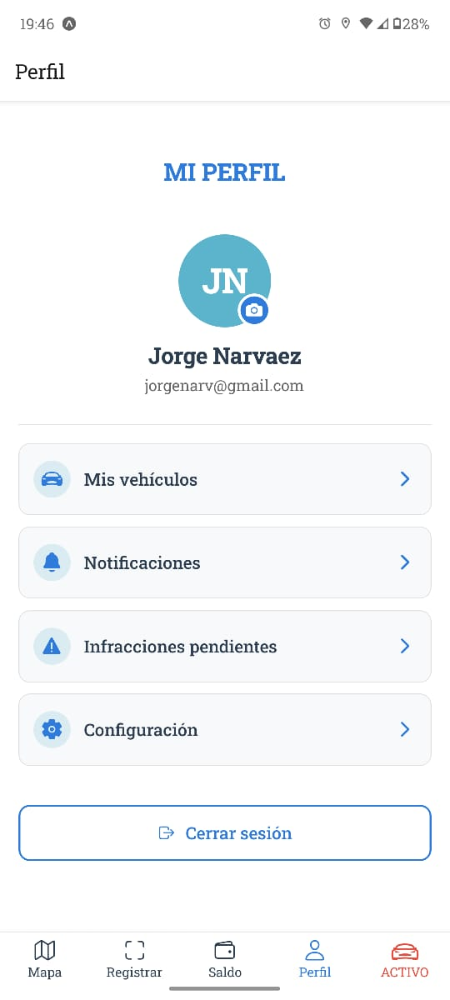

# ParkApp - Sistema de Gestión de Estacionamiento

ParkApp es una aplicación móvil integral construida con React Native y TypeScript que facilita la gestión de espacios de estacionamiento. La aplicación atiende dos roles principales de usuario: usuarios finales que buscan soluciones de estacionamiento y administradores que supervisan las operaciones del sistema de estacionamiento.

## 🚀 Características

### 👤 Características para Usuarios Finales
- **Registro y Autenticación de Usuarios**: Registro seguro y login con validación completa de formularios.
- **Gestión de Estacionamiento y Vehículos**: Manejo de sesiones activas de estacionamiento, registro rápido de vehículos y acceso a historial detallado.
- **Captura de Patente con Cámara**: Uso de la cámara del dispositivo para capturar la patente del vehículo, facilitando el ingreso y reduciendo errores.
- **Mapa Interactivo en Tiempo Real**: Visualización clara y actualizada de espacios disponibles para estacionar, mejorando la experiencia de búsqueda.
- **Gestión de Saldo y Pagos**: Funcionalidad integrada para recarga y control del saldo disponible en la billetera digital para pagos rápidos.
- **Notificaciones en Tiempo Real**: Alertas sobre cambios en el estado del estacionamiento, saldo bajo, multas emitidas y confirmaciones de recargas.
- **Configuración y Gestión de Perfil**: Opciones para editar datos personales, cambiar contraseñas y gestionar la sesión del usuario con facilidad.
- **Soporte y Ayuda**: Acceso a canales de soporte directos para resolver dudas y reportar problemas relacionados con el uso de la aplicación.

### 🛠️ Características para Administradores
- **Dashboard Analítico Avanzado**: Panel con indicadores clave y estadísticas en tiempo real que proporcionan una visión completa del sistema.
- **Gestión Integral de Usuarios**: Capacidad para añadir, modificar, eliminar y monitorear cuentas de usuarios con herramientas administrativas avanzadas.
- **Administración de Espacios de Estacionamiento**: Control sobre la configuración, actualización y supervisión de la disponibilidad y asignación de espacios.
- **Manejo Eficiente de Infracciones**: Emisión, revisión y seguimiento detallado de multas, incluyendo historial y estado de cumplimiento.
- **Registro Manual y Corrección de Datos**: Herramientas para ingresar vehículos o corregir registros directamente desde la interfaz administrativa.
- **Mapa Dinámico para Supervisión**: Visualización geolocalizada de todos los espacios y su estado, con indicadores visuales útiles para la toma de decisiones.
- **Configuración y Parámetros del Sistema**: Ajuste de diferentes parámetros del sistema, incluyendo políticas, notificaciones y opciones de seguridad.
- **Reportes y Exportación de Datos**: Generación de reportes personalizados y exportables para análisis y auditorías periódicas.

## 🛠️ Stack Tecnológico

### Tecnologías Core
- **React Native 0.81.4**: Desarrollo móvil multiplataforma
- **Expo ~54.0.9**: Plataforma de desarrollo y herramientas de construcción
- **TypeScript ~5.9.2**: Desarrollo JavaScript con tipos seguros

### Navegación y UI
- **React Navigation**: Navegación Stack, Tab y Drawer
- **Styled Components 6.1.19**: Solución de estilos CSS-in-JS
- **Expo Vector Icons**: Librería de iconos
- **React Native Animatable**: Librería de animaciones

### Mapas y Ubicación
- **React Native Maps 1.20.1**: Componentes de mapas interactivos
- **Expo Location ~19.0.7**: Servicios de ubicación y permisos

### Datos y Almacenamiento
- **Async Storage**: Persistencia de datos locales
- **Expo Secure Store**: Almacenamiento seguro de clave-valor
- **React Native Get Random Values**: Utilidades criptográficas

### Herramientas de Desarrollo
- **Expo Camera ~17.0.8**: Funcionalidad de cámara para escaneo
- **Expo Linear Gradient**: Fondos con gradientes
- **React Native Reanimated ~4.1.0**: Animaciones avanzadas
- **React Native Gesture Handler**: Gestión de gestos táctiles

## 📁 Estructura del Proyecto

```
parkapp/
├── components/                      # Componentes UI reutilizables adicionales
├── constants/                       # Constantes y configuraciones de la app
├── screens/                         # Componentes de pantalla
├── src/                             # Código fuente principal
│   ├── assets/                      # Activos estáticos (iconos, imágenes, screenshots)
│   ├── components/                  # Componentes UI reutilizables
│   │   ├── adminpanel/              # Componentes específicos de admin (si aplicable)
│   │   ├── auth/                    # Componentes de autenticación
│   │   ├── cards/                   # Componentes de tarjetas
│   │   ├── common/                  # Componentes comunes compartidos
│   │   ├── dashboard/               # Widgets del dashboard
│   │   ├── grids/                   # Diseños de cuadrícula
│   │   ├── historial/               # Componentes de historial
│   │   ├── infractions/             # Gestión de infracciones
│   │   ├── modals/                  # Diálogos modales
│   │   ├── navigation/              # Componentes de navegación
│   │   ├── registration/            # Componentes de registro
│   │   └── shared/                  # Utilidades y contexto compartidos
│   ├── config/                      # Configuraciones (API, Firebase, tema)
│   ├── forms/                       # Componentes de formularios
│   ├── hooks/                       # Hooks personalizados de React
│   ├── screens/                     # Componentes de pantalla
│   │   ├── admin/                   # Pantallas de admin
│   │   ├── auth/                    # Pantallas de autenticación
│   │   └── user/                    # Pantallas de usuario
│   ├── services/                    # Servicios API y lógica de negocio
│   └── utils/                       # Funciones utilitarias y helpers
├── utils/                           # Utilidades adicionales
└── [otros archivos de configuración]
```

## 🚀 Instalación y Configuración

### Prerrequisitos
- Node.js (v16 o superior)
- npm o yarn
- Expo CLI
- Android Studio (para desarrollo Android)
- Xcode (para desarrollo iOS, solo macOS)

### Pasos de Instalación

1. **Clonar el repositorio**
   ```bash
   git clone <https://github.com/Liria95/parkapp-trabajo-final.git>
    
   cd parkapp
   ```

2. **Instalar dependencias**
   ```bash
   npm install
   ```

3. **Iniciar el servidor de desarrollo**
   ```bash
   npm start
   # o
   npx expo start
   ```

4. **Ejecutar en plataforma específica**
   ```bash
   # Android
   npm run android
   # o
   npx expo start --android

   # iOS
   npm run ios
   # o
   npx expo start --ios

   # Web
   npm run web
   # o
   npx expo start --web
   ```

## 📱 Uso
## 📸 Capturas de Pantalla

### 👤 Usuario Final
<p align="center">

  
  
  
  
  
  
    
  
  
  
  
  
  
  
  
  
  
  


</p>

### 🛠️ Administrador
<p align="center">

  
  
  
  
  
  
  
  
  
  
  
  
</p>


### Para Usuarios Finales
1. **Registro y autenticación**: Crear una cuenta con validación de correo electrónico y contraseña segura, además de iniciar sesión para acceder a la app.
2. **Gestión de perfil y vehículos**: Editar y actualizar información personal, registrar y administrar múltiples vehículos para facilitar el inicio rápido de sesiones de estacionamiento.
3. **Búsqueda y visualización de espacios de estacionamiento**: Navegar por un mapa interactivo que muestra en tiempo real los espacios disponibles, con indicadores visuales claros del saldo actual.
4. **Inicio y gestión de sesiones de estacionamiento**: Registrar la patente del vehículo utilizando la cámara del dispositivo móvil para mayor comodidad, iniciar y monitorear sesiones activas con alertas oportunas.
5. **Gestión y recarga de saldo**: Consultar el saldo disponible, recibir notificaciones sobre saldo insuficiente y realizar recargas fácilmente, garantizando fondos suficientes para el uso del estacionamiento.
6. **Historial y notificaciones**: Visualizar el historial de estacionamientos y multas pendientes, y recibir notificaciones en tiempo real sobre recargas exitosas, infracciones o cambios en el estado del usuario.

### Para Administradores
1. **Acceso seguro y panel administrativo**: Iniciar sesión con credenciales administrativas para acceder a un panel completo y funcional.
2. **Dashboard con métricas y análisis en tiempo real**: Monitorear indicadores clave, estadísticas de usuarios, actividades y estado general del sistema a través de gráficos y reportes visuales.
3. **Gestión integral de usuarios**: Visualizar, editar y administrar información de usuarios, facilitando el control y soporte.
4. **Administración de espacios de estacionamiento**: Supervisar y actualizar la configuración de espacios, incluyendo la disponibilidad y asignación.
5. **Gestión de infracciones**: Emitir multas, revisar estados y hacer seguimiento a las infracciones de manera eficiente desde el panel administrativo.
6. **Registro manual y soporte administrativo**: Añadir registros de vehículos manualmente en nombre de los usuarios, asistiendo en casos especiales o correcciones.

## 🔐 Cuentas de Prueba

### Cuentas de Administrador
- **Email**: admin@parkapp.com | **Contraseña**: admin123

### Registro de Usuario
- Los nuevos usuarios pueden registrarse a través de la pantalla de registro de la aplicación
- Todos los registros requieren verificación de email y confirmación de contraseña

## 📋 Componentes Clave

### Sistema de Autenticación
- Funcionalidad segura de login/logout
- Validación de formularios con retroalimentación en tiempo real
- Detección automática de rol de usuario

### Integración de Mapas
- Visualización interactiva de espacios de estacionamiento
- Actualizaciones de disponibilidad en tiempo real
- Servicios basados en ubicación

### Sistema de Notificaciones
- Alertas de sesiones de estacionamiento
- Notificaciones de multas
- Advertencias de saldo

### Panel de Administración
- Dashboard completo con KPIs
- Interfaz de gestión de usuarios
- Sistema de rastreo de infracciones

## 🤝 Contribuyendo

1. LIRIA OLIVERA
2. ANABELLA VENTAVOLI
3. MONICA MARIA ZULUAGA PELAEZ
4. MARIANELA DAGATTI


## 📞 Soporte

Para soporte y preguntas, por favor contacte al equipo de desarrollo o cree un issue en el repositorio.

---

**Construido con usando React Native & Expo**

